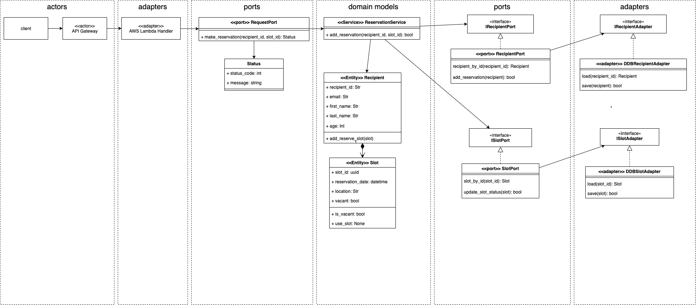
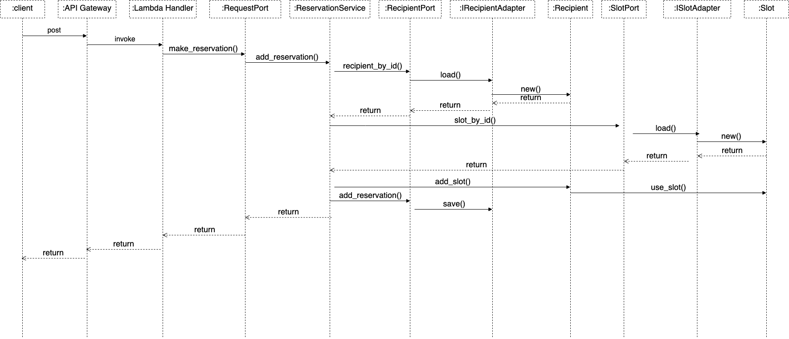

# JAWS Pankration 2021 - DDD on AWS Lambda sample

## What is this project?

This project contains sample code for AWS Lambda with domain models. I presented the session about how to implement an AWS Lambda function with domain models at [JAWS Pankration 20201](https://jawspankration2021.jaws-ug.jp/en). This repository shows you how to implement your domain models, ports and adapters classes on AWS Lambda function. This project includes sample domain models regarding a vaccination reservation system and these are loosly coupled from infrastructure code such as accessing a DynamoDB table using ports and adapters classes. This application is designed by concept of [hexagonal architecture](<https://en.wikipedia.org/wiki/Hexagonal_architecture_(software)>) or ports and adapters architecture by [Alistair Cockburn](https://en.wikipedia.org/wiki/Alistair_Cockburn). This application also uses [injector](https://github.com/alecthomas/injector) Python library to inject ports and adapters classes. It elables you to execute unit testing more easily because you can inject dummy instances into target classes. For more details, see sample unit testing code in this project. (./tests/unit folder)

## Domain Models



## Sequence diagram for this application



## Serverless Application Model

This project contains source code and supporting files for a serverless application that you can deploy with the SAM CLI. It includes the following files and folders.

- src - Code for the application's Lambda function.
- events - Invocation events that you can use to invoke the function.
- tests/unit - Unit tests for the application code.
- template.yaml - A template that defines the application's AWS resources.

## Deploy the sample application

The Serverless Application Model Command Line Interface (SAM CLI) is an extension of the AWS CLI that adds functionality for building and testing Lambda applications. It uses Docker to run your functions in an Amazon Linux environment that matches Lambda. It can also emulate your application's build environment and API.

To use the SAM CLI, you need the following tools.

- SAM CLI - [Install the SAM CLI](https://docs.aws.amazon.com/serverless-application-model/latest/developerguide/serverless-sam-cli-install.html)
- [Python 3 installed](https://www.python.org/downloads/)
- Docker - [Install Docker community edition](https://hub.docker.com/search/?type=edition&offering=community)

To build and deploy your application for the first time, run the following in your shell:

```bash
sam build --use-container
sam deploy --guided
```

The first command will build the source of your application. The second command will package and deploy your application to AWS, with a series of prompts:

You can find your API Gateway Endpoint URL in the output values displayed after deployment.

## Prepare DynamoDB data before you execute this function

When you execute this function you need to execute data prepare script.

```bash
$ chmod +x setup/add_ddb_data.sh
$ setup/add_ddb_data.sh

```

## Use the SAM CLI to build and test locally

Build your application with the `sam build --use-container` command.

```bash
vaccination_reservation_demo$ sam build --use-container
```

The SAM CLI installs dependencies defined in `src/requirements.txt`, creates a deployment package, and saves it in the `.aws-sam/build` folder.

Test a single function by invoking it directly with a test event. An event is a JSON document that represents the input that the function receives from the event source. Test events are included in the `events` folder in this project.

Run functions locally and invoke them with the `sam local invoke` command.

```bash
vaccination_reservation_demo$ sam local invoke HelloWorldFunction --event events/event.json
```

## Tests

Tests are defined in the `tests` folder in this project. Use PIP to install the test dependencies and run tests.

```bash
vaccination_reservation_demo$ pip install -r tests/requirements.txt --user
# unit test
vaccination_reservation_demo$ python -m pytest tests/unit -v
# integration test, requiring deploying the stack first.
# Create the env variable AWS_SAM_STACK_NAME with the name of the stack we are testing
vaccination_reservation_demo$ AWS_SAM_STACK_NAME=<stack-name> python -m pytest tests/integration -v
```

## Cleanup

To delete the sample application that you created, use the AWS CLI. Assuming you used your project name for the stack name, you can run the following:

```bash
aws cloudformation delete-stack --stack-name vaccination_reservation_demo
```

## Resources

See the [AWS SAM developer guide](https://docs.aws.amazon.com/serverless-application-model/latest/developerguide/what-is-sam.html) for an introduction to SAM specification, the SAM CLI, and serverless application concepts.

Next, you can use AWS Serverless Application Repository to deploy ready to use Apps that go beyond hello world samples and learn how authors developed their applications: [AWS Serverless Application Repository main page](https://aws.amazon.com/serverless/serverlessrepo/)
